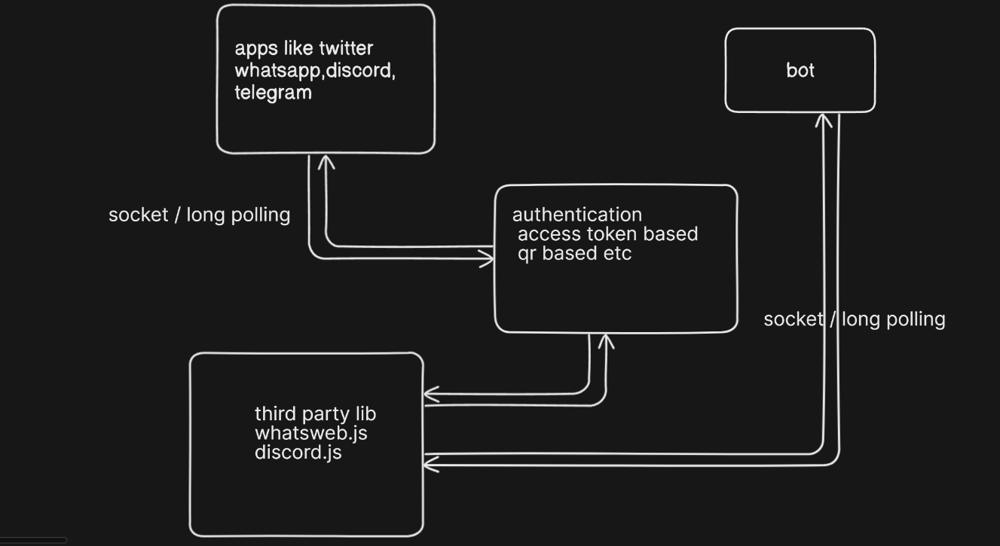
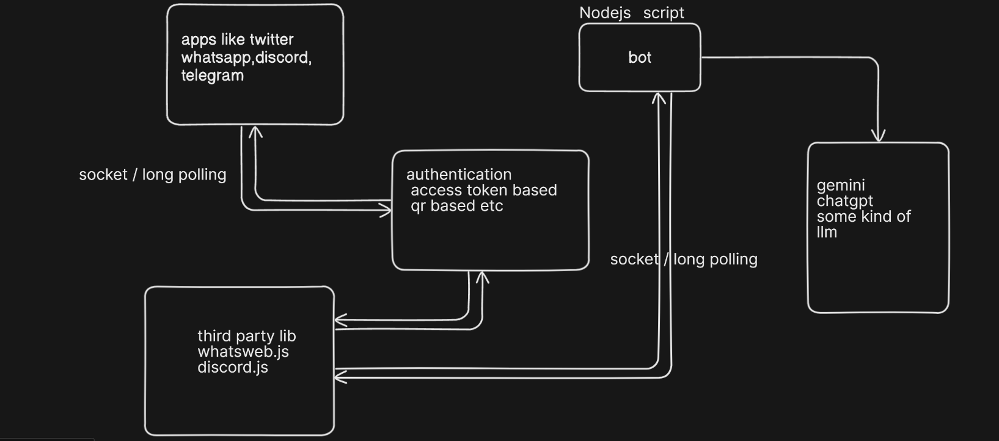

# Bot Development Guide

This guide covers the stages for creating bots on various platforms: WhatsApp, Discord, Twitter, and Telegram.

## 1. WhatsApp Bot

### Stage 1: Choose a Library
- Use `whatsapp-web.js` or `venom-bot` for Node.js to interact with WhatsApp Web.

### Stage 2: Authentication
- When you first run the bot, it will generate a QR code.
- Scan this QR code with the WhatsApp app on your phone to authenticate the bot.
- The session is saved locally, so you don’t need to scan the QR code every time.

### Stage 3: Development
- Write scripts to handle incoming messages, send automated replies, or perform actions based on specific commands.
- You can handle media files, create group chats, or broadcast messages depending on your needs.

### Stage 4: Deployment
- Deploy your bot to a server (like Heroku, AWS, or DigitalOcean) to keep it running continuously.
- Ensure the server can maintain the session data to avoid re-authentication.

### Stage 5: Maintenance
- Regularly update the library and bot script to accommodate changes in WhatsApp’s web interface.

## 2. Discord Bot

### Stage 1: Choose a Library
- Use `discord.js` (Node.js) or `discord.py` (Python) for creating your Discord bot.

### Stage 2: Create a Discord Bot Account
- Go to the [Discord Developer Portal](https://discord.com/developers/applications) and create a new application.
- Create a bot within this application and get your bot token.

### Stage 3: Development
- Write scripts to handle events like messages, commands, joining/leaving servers, etc.
- Use features like embeds, reactions, and voice channel interaction.

### Stage 4: Add Bot to a Server
- Generate an OAuth2 link with appropriate permissions to invite your bot to a Discord server.
- Use this link to add the bot to your desired server(s).

### Stage 5: Deployment
- Host your bot on a server (e.g., Heroku, AWS) to ensure it stays online and responsive.

### Stage 6: Maintenance
- Keep the bot updated with new features or changes in the Discord API.

## 3. Twitter Bot

### Stage 1: Choose a Library
- Use `tweepy` (Python) or `twit` (Node.js) to interact with Twitter’s API.

### Stage 2: Create a Twitter Developer Account
- Apply for a Twitter Developer Account and create a new app.
- Obtain API keys, access tokens, and secret keys required for authentication.

### Stage 3: Authentication
- Use OAuth to authenticate your bot with the Twitter API.
- Store the keys and tokens securely in your environment variables.

### Stage 4: Development
- Write scripts to post tweets, reply to mentions, retweet, follow users, or stream tweets based on specific hashtags or keywords.

### Stage 5: Deployment
- Host your bot on a server to run continuously and monitor Twitter activity.

### Stage 6: Compliance and Maintenance
- Ensure your bot complies with Twitter’s automation rules and update it to handle changes in the API.

## 4. Telegram Bot

### Stage 1: Choose a Library
- Use `python-telegram-bot` (Python) or `node-telegram-bot-api` (Node.js).

### Stage 2: Create a Telegram Bot
- Chat with [BotFather](https://t.me/botfather) on Telegram to create a new bot.
- Get the bot token after creating your bot.

### Stage 3: Development
- Write scripts to handle commands, messages, and interactions with users.
- Utilize Telegram's features like inline keyboards, buttons, and rich media.

### Stage 4: Deployment
- Deploy your bot to a server to keep it running 24/7.
- Optionally, set up a webhook to improve responsiveness.

### Stage 5: Add Bot to Groups or Channels
- Invite your bot to Telegram groups or channels where it can interact with users.

### Stage 6: Maintenance
- Keep your bot updated and monitor Telegram for API changes or new features you can integrate.

